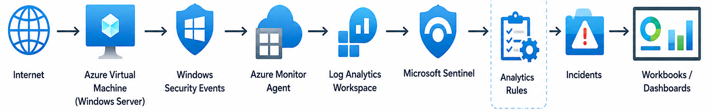

# 🔐 Azure Sentinel Threat Monitoring & Detection Lab

## 📌 Project Overview

This project demonstrates the deployment of a cloud-based Security Operations Centre (SOC) using **Microsoft Azure** and **Microsoft Sentinel**.

The lab simulates a real-world security monitoring environment capable of:
- Collecting and analysing security logs
- Detecting malicious activity (e.g., brute-force attacks)
- Investigating incidents
- Visualising security insights using dashboards and workbooks
---
## 🎯 Project Objectives

- Deploy an Azure Virtual Machine  
- Configure Log Analytics Workspace  
- Integrate Microsoft Sentinel  
- Collect Windows Security Events  
- Monitor RDP and SSH activity  
- Detect brute-force attacks  
- Perform threat hunting using KQL  
- Create analytics rules for automated detection  
- Investigate security incidents  
- Build dashboards and visualisations  

---

## 🏗️ Architecture & Implementation Workflow

The following diagram illustrates the end-to-end data flow and implementation workflow of the lab:


---
### 🔄 Workflow Summary

Internet traffic targets an exposed Azure Virtual Machine, generating Windows Security Events.  
These events are collected via the Azure Monitor Agent and sent to a Log Analytics Workspace.  

Microsoft Sentinel ingests the logs and applies analytics rules to detect suspicious behaviour.  
Detected events generate incidents, which trigger automation workflows and alert notifications (email).  

Security incidents are then investigated using KQL queries, while dashboards and workbooks provide ongoing visibility into threats and system activity.

---

## 🧰 Technologies Used

 Technology | Purpose |
|----------|--------|
| Azure Virtual Machine | Target system for attack simulation |
| Log Analytics Workspace | Centralised log collection |
| Microsoft Sentinel | SIEM platform |
| Azure Monitor Agent | Telemetry/data collection |
| KQL (Kusto Query Language) | Threat hunting & analysis |
| Workbooks | Data visualisation |
| Analytics Rules | Detection & alerting |
| Logic Apps / Playbooks | Automation & response |

---

## ⚙️ Lab Implementation

### ✅ Step 1 – Azure VM Deployment

- Deployed a **Windows Server VM** exposed to the internet  
- Enabled:
  - RDP (Port 3389)
  - SSH (Port 22)

**Purpose:**
- Simulate real-world attack surface  
- Attract brute-force login attempts  

📷 Overview: images/azure-vm.png  
📷 Network Configuration: images/vm-networking.png 

---

### ✅ Step 2 – Log Analytics Workspace

- Created a centralised **Log Analytics Workspace**
- Collected:
  - SecurityEvent logs  
  - Authentication logs  
  - System telemetry  

📷 Workspace Overview: images/log-analytics-workspace.png  
📷 Log Query Results: images/log-analytics-logs.png  

---

### ✅ Step 3 – Microsoft Sentinel Setup

- Connected Sentinel to the workspace  
- Enabled:
  - Threat detection  
  - Threat hunting  
  - Incident management  

📷 Sentinel Overview: images/sentinel-overview.png  
📷 Data Connectors: images/sentinel-data-connectors.png  

---

### ✅ Step 4 – Data Collection Configuration

- Configured **Azure Monitor Agent (AMA)**  
- Collected:
  - Failed login attempts  
  - Successful logins  
  - Authentication events  

📷 Data Collection Rule Overview: images/data-collection-rule.png  
📷 Data Sources Configuration: images/data-sources.png  

---

## 🔍 Threat Hunting (KQL)

### 🔸 Failed Login Detection
```kql
SecurityEvent
| where EventID == 4625
| summarize Count = count() by IpAddress
| order by Count desc
```
✅ Identifies brute-force login attempts

### 🔸 Successful Login Detection
```kql
SecurityEvent
| where EventID == 4624
```
✅ Tracks successful authentication events

### 🔸 Top Attacking IPs
```kql
SecurityEvent
| where EventID == 4625
| summarize Attempts = count() by IpAddress
| order by Attempts desc
```

✅ Highlights suspicious source IPs

📷 Example Output:
images/kql-failed-logins.png

##🚨 Detection & Automation (Analytics Rules)
🔹 Brute Force Detection (RDP & SSH Activity)

Detects multiple failed login attempts from the same IP address within a short time window, indicating potential brute-force attack activity.

Detection Logic:
EventID 4625 (failed logons)
Same source IP
High-frequency attempts within a short time window
🔹 KQL Query
```kql
SecurityEvent
| where EventID == 4625
| summarize FailedAttempts = count() by IpAddress, bin(TimeGenerated, 5m)
| where FailedAttempts > 2
```
📷 Detection Rule Configuration:
images/rdp-alert-rule.png


## 🚨 Detection & Automation (Analytics Rules)

### 🔹 Automation & Alerting

Automation was implemented using **Microsoft Sentinel Playbooks (Logic Apps)** to enhance detection and response capabilities.

**Key Features:**
- Automatic alert generation from analytics rules  
- Triggered workflows upon incident creation  
- Email notifications for real-time alerting  

📷 Automation Rule: images/automation-rule.png  
📷 Playbook: images/playbook.png  

---

### 🔹 Email Alert Notification

Email notifications were configured to alert on triggered security incidents.

**Purpose:**
- Real-time alerting  
- Faster incident response  
- Improved visibility of security events  

📷 Email Alert Example: images/email-alert.png  

---

> **Note:** Detection is based on authentication events (EventID 4625). Windows Security logs do not explicitly distinguish between RDP and SSH. The distinction is inferred based on exposed services (RDP on Port 3389 and SSH on Port 22) within the lab environment.

---

## 🧪 Incident Investigation

During monitoring, multiple suspicious activities were observed and investigated using Microsoft Sentinel.

### 🔍 Observed Activity

- Repeated failed RDP login attempts  
- Continuous SSH login attempts  
- Password spraying behaviour  
- Internet-wide scanning activity  

---

### 🛠️ Investigation Tools

- Microsoft Sentinel Incidents  
- SecurityEvent logs  
- KQL queries  

---

### 🧩 Investigation Process

1. Identified incidents triggered by analytics rules  
2. Analysed associated alerts and entities  
3. Queried logs using KQL  
4. Correlated suspicious IP activity  
5. Confirmed brute-force attack patterns  

📷 Example: images/incidents/incident-details.png  

---

## 📊 Dashboard & Visualisation

A Microsoft Sentinel Workbook was created to visualise security insights and attack patterns.

### 📈 Metrics Visualised

- Failed login attempts  
- Successful login activity  
- Top attacking IP addresses  
- Authentication trends over time  
- Incident counts and alert trends  

📷 Dashboard: images/workbook-dashboard.png  

---

## 📌 Key Findings

- Public-facing systems are scanned almost immediately after deployment  
- RDP (Port 3389) and SSH (Port 22) are primary attack vectors  
- Microsoft Sentinel provides centralised security visibility  
- KQL enables rapid and flexible threat investigation  
- Automation significantly enhances response efficiency  

---

## 🧠 Skills Demonstrated

- Cloud Security Monitoring  
- SIEM Deployment (Microsoft Sentinel)  
- Threat Hunting & Detection Engineering  
- Incident Investigation & Analysis  
- KQL Query Development  
- Azure Administration  
- SOC Operations  
- Security Automation (SOAR concepts)  

---

## 🚀 Future Improvements

- Integrate Threat Intelligence feeds for enhanced detection  
- Automate response actions using Sentinel Playbooks (SOAR)  
- Deploy honeypots for advanced attack simulation  
- Implement User and Entity Behaviour Analytics (UEBA)  
- Integrate Microsoft Defender for Endpoint  

---

## 📁 Repository Structure


Azure-Sentinel-Threat-Monitoring-Lab/
│
├── images/
│   ├── architecture.png
│   ├── rdp-alert-rule.png
│   ├── workbook-dashboard.png
│   ├── automation-rule.png
│   ├── playbook.png
│   ├── email-alert.png
│   └── incidents/
│       └── incident-details.png
│
├── kql/
│   ├── failed-logons.kql
│   ├── successful-logons.kql
│   └── bruteforce-detection.kql
│
└── README.md


---

## 🔗 Project Value

This project demonstrates the implementation of a **cloud-native SIEM solution**, including:

- End-to-end log ingestion  
- Real-time threat detection  
- Automated alerting and response  
- Incident investigation workflows  
- Security data visualisation  

---

## ⭐ Author

**Simon Yusuf Enoch**  
